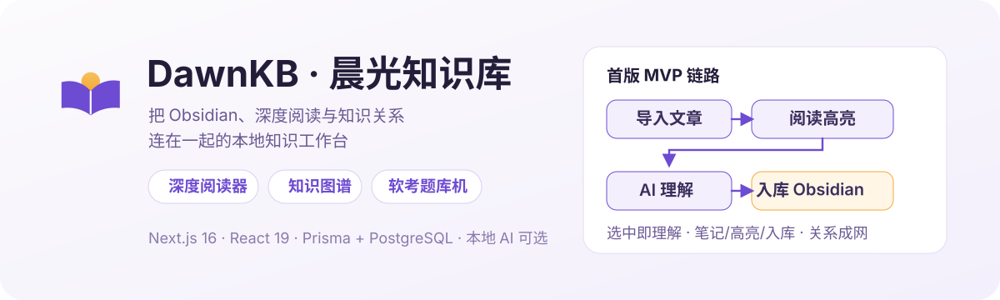
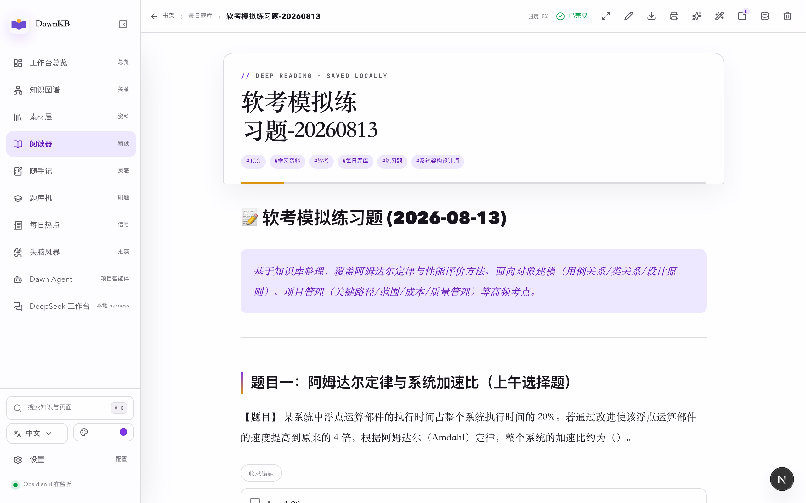
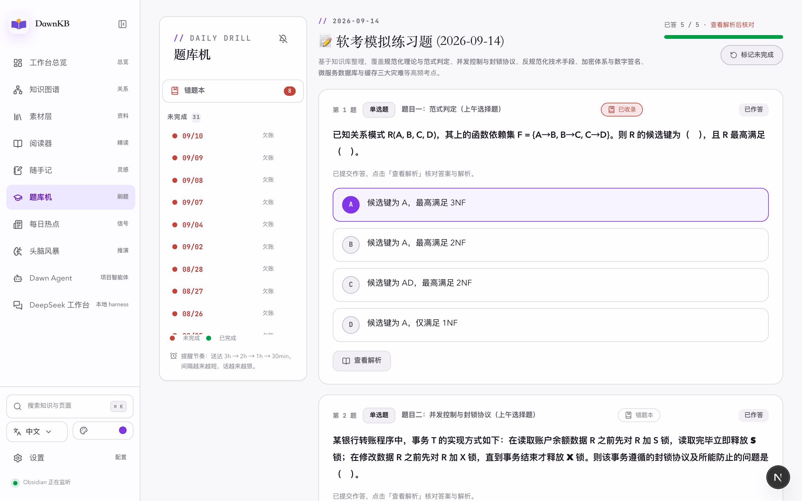

<p align="center">
  
</p>

# DawnKB · 晨光知识库

一个跑在本机的知识工作台：把 **Obsidian 笔记、深度阅读、知识图谱、内容复盘与每日刷题** 连成一条链路。
文章导入后在网页里精读，选中文字即可高亮、笔记、让 AI 解释，确认后写回 Obsidian；笔记之间的关系自动织成图谱。

## 看一眼真实界面

<table>
  <tr>
    <td align="center" width="50%">
      
      <br><sub>阅读器：选中即高亮 / 笔记 / AI 理解</sub>
    </td>
    <td align="center" width="50%">
      
      <br><sub>题库机：每日题集 + 提醒升级 + 错题本</sub>
    </td>
  </tr>
</table>

## 它解决什么

知识工具散落的痛点：阅读在浏览器、笔记在 Obsidian、复盘在表格、刷题在 App。
DawnKB 把这些动作收进一个网页工作台，**Obsidian 仍是唯一事实源**——网页只是它的读写界面与关系层。

首版 MVP 链路：

```text
导入文章 → 阅读 → 高亮/笔记 → AI 理解 → 人工确认入库 Obsidian → 搜索复用
```

## 差异点（机制，不是口号）

| 能力 | 机制 |
|------|------|
| 阅读器 + AI 一体 | 选中文本弹出操作条：理解、笔记、高亮、入库；AI 回答可一键存为笔记 |
| 知识图谱 | 解析 wikilink 与正文共现，从「文件列表」升级为可交互关系网络 |
| 评论 → 选题闭环 | 抓取各平台评论，聚类出可写的选题方向 |
| 每日精读 | 聚合订阅源，每天帮你选好一篇并生成导读 |
| 软考题库机 | 每天 9:00 由本地 agent 从知识库随机抽知识点出 5 题；提醒按 3h→2h→1h→30min 升级；错题手动收录进错题本 |
| 数据聚合 | 各创作平台的阅读/互动数据集中复盘 |

## 快速启动

前置：Node 20+、本地 PostgreSQL（或 Orbstack/Docker）、Obsidian vault 路径。

```bash
git clone https://github.com/chenguang-jiang/personal_workbench.git
cd personal_workbench
npm install

cp .env.example .env.local   # 填入 DATABASE_URL 与 OBSIDIAN_VAULT_PATH
npm run db:generate
npm run db:migrate           # 或 db:push 按 schema 直接同步
npm run db:seed              # 可选：示例数据

npm run dev                  # http://localhost:3000
```

Obsidian 同步（监听 vault 变化、增量入库）：

```bash
npm run obsidian:sync
```

## 功能地图

- **工作台总览**：今日待办、知识增量、数据卡片
- **阅读器**：Obsidian 文章网页化精读，高亮/笔记/批注侧栏，内嵌题块可勾选与收录错题
- **知识图谱**：空间/节点/关系三层可视化
- **随手记 / 头脑风暴**：碎片捕获与 AI 推演
- **每日热点 / 每日精读**：信号聚合与导读
- **题库机**：每日题集、完成标记、提醒升级、错题本
- **Dawn Agent / DeepSeek 工作台**：本地 agent 会话与 harness 接入

## 技术栈

| 技术 | 版本 | 用途 |
|------|------|------|
| Next.js | 16.3 | App Router，前端 + API |
| React | 19.2 | UI |
| Tailwind CSS | v4 | 设计系统 |
| Prisma | 7.9 | ORM（pg adapter） |
| PostgreSQL | 17 | 存储 |
| Zustand | 5.x | 状态管理 |
| AI SDK | 7.x | 流式 AI 输出 |
| Ollama | — | 本地模型（可选） |

## 仓库结构

```text
src/app/            页面与 API 路由（reading、quiz、graph、brainstorm…）
src/components/     阅读器、图谱等交互组件
src/lib/            解析/同步/序列化/题库核心逻辑
prisma/             schema 与迁移
docs/               设计文档与实施计划
assets/readme/      README 视觉资产
```

## 说明

- 个人项目，数据全部留在本机；仓库不含任何密钥与 `.env`
- 题集与笔记内容在私有 Obsidian vault，不在本仓库
