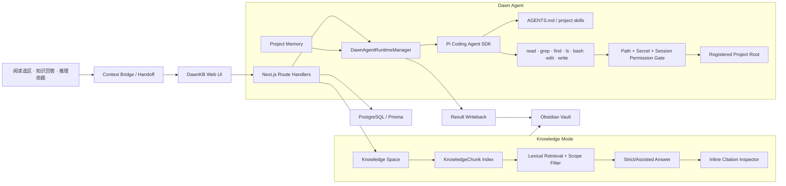
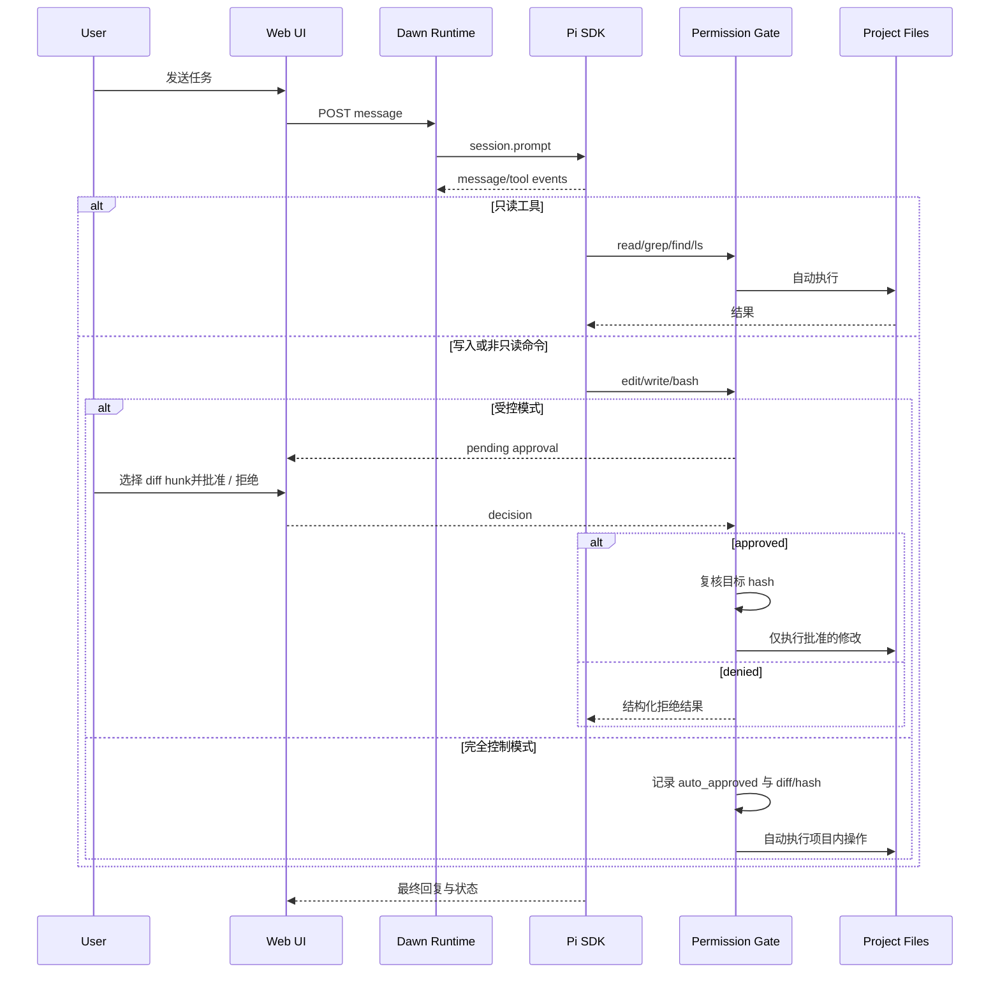
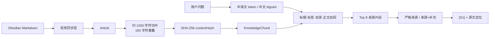

# Dawn Agent 架构、实现与产品说明

> [!abstract] 一句话定义
> Dawn Agent 是 DawnKB 内置的本地项目 Agent：它把 Pi Coding Agent SDK 嵌入 Web 工作台，在用户明确注册的项目根目录内读取、检索、修改与验证代码；每个会话可选择“受控”或“完全控制”，两种模式都保留硬安全边界与完整审计。

> [!success] 当前状态
> 既定产品范围已经完成：除真实 Pi 模型对话、来源引用和人工审批外，现已具备会话级“受控 / 完全控制”权限模式、跨阅读/知识库/推理的 Context Bridge、项目长期记忆、并排 diff、按 hunk 局部批准、SSE 实时刷新、引用原文精确定位、结果回写 Obsidian、桌面三栏工作台和移动端抽屉适配。Dawn Agent 使用现有 `~/.pi/agent` 模型配置与凭据，不复制、不展示密钥。

## 一、产品结构

DawnKB 中的 Agent 能力分成两个互补层级：

1. **Dawn Agent**：左侧导航中的独立功能，面向一个真实本地代码项目，是完整的项目 Agent。
2. **头脑风暴**：保留为知识工作流，内部拥有两种固定会话模式。
   - **推理模式**：原有结构化推演、路线、命题台账与写回。
   - **知识库模式**：NotebookLM 式来源问答，答案基于选定的 Obsidian 来源，并附可回到原文的引用。

二者不是同一个模式：

- Dawn Agent 处理“理解项目、改代码、跑验证”。
- 知识库模式处理“围绕我的知识来源检索、比较、归纳和沉淀”。
- 知识库回答可以转成命题，或携带证据进入推理模式。
- 阅读器选中文本后的“理解”不再维护第二套聊天能力，而是统一为“交给 Dawn Agent”；解释、质疑、整理为任务仍作为交接预设保留。
- 阅读、知识库和推理不直接执行代码工具，而是生成一份可追溯 handoff；Dawn Agent 接收后再绑定具体项目、会话和权限边界。

## 二、功能亮点

### Dawn Agent

- 注册一个真实本地项目，保存规范化后的 `realpath`。
- 读取项目目录、`AGENTS.md` 和项目内已有 skills。
- 使用 Pi SDK 的会话、模型、工具调用、上下文与持久化能力。
- 在 Web 时间线中呈现用户消息、Agent 回复、工具开始/结束、审批与安全事件。
- 会话通过 SSE 接收轻量刷新信号；断线时自动重连，并以低频完整刷新兜底。
- 工具结束事件记录执行耗时，时间线可直接观察慢工具。
- 支持读取、搜索、目录发现、命令、编辑和写入。
- 同一会话只运行一个 Agent turn；支持停止。
- 每个会话可切换“受控”或“完全控制”，选择会持久化到数据库。
- 受控模式下，写文件、编辑文件和非只读命令进入内联审批卡片。
- 完全控制模式下，通过硬安全门的项目内 edit/write 与普通 Bash 自动执行，不再逐次询问；每次自动授权仍保存参数、diff、hash、时间和执行结果。
- 等待审批时切到完全控制，会自动批准当前待执行动作；edit 默认选中全部 hunk 并继续当前 Agent turn。
- 编辑审批显示新旧内容并排 diff，可逐个勾选修改块，只批准需要的 hunk。
- 拒绝审批会把结构化拒绝结果返回 Pi，Agent 可继续解释或改换方案。
- 阅读选区、整篇文档、知识库答案与推理命题都可带来源交接到新会话或当前会话。
- 每个项目拥有可启停的长期记忆；记忆会在每次 prompt 前动态注入，不修改仓库文件。
- Agent 的最终结果可以保存为项目记忆，也可以一键回写到 Obsidian，形成“知识 → 行动 → 新知识”的闭环。
- 工具参数和输出在入库前脱敏，并限制日志长度。
- 不自动提交、不推送、不发布、不部署。

### 头脑风暴知识库模式

- 会话创建时固定为“推理”或“知识库”模式。
- Knowledge Space 可选择整个 Vault、文件夹或单篇文档，并可复用。
- 默认“严格来源”：证据不足时明确说没有足够证据。
- 可切换“来源 + 模型补充”，但回答必须把来源结论和模型补充分区。
- 文档被切分成带字符偏移的片段，回答使用 `[S1]` 一类内联引用。
- 点击引用打开右侧检查器，显示原文、Vault 路径、字符范围和“打开原文”；进入阅读器后自动滚动并高亮对应来源文本。
- 回答可保存为 Obsidian 笔记、转为命题、携带证据进入推理模式。

## 三、总体架构

### 为什么直接嵌入 Pi SDK

项目要求 Agent 操作真实本地代码目录、执行本机项目工具链并保留 Pi 会话。采用 Pi SDK 直接嵌入同一个 Node 服务进程，可以获得：

- Pi 原生 Agent loop、工具协议、模型目录、session JSONL、compaction 和上下文加载。
- 精确绑定项目 `cwd`，继续使用用户已经安装的 Pi 配置。
- 在工具执行前插入 DawnKB 自己的权限门。
- 把事件转换为 Web 时间线，而不依赖终端 UI 或子进程文本解析。

Pi 官方安全模型明确指出：Pi 本身不是沙箱。Dawn Agent 的权限门降低误操作风险，但不把进程内策略包装成操作系统隔离。处理不可信仓库或无人值守任务时，仍应使用容器、虚拟机或微型 VM。

### 为什么不是直接打开 Pi

Pi 是可靠的 Agent runtime；Dawn Agent 是围绕它建立的产品控制层。两者不是互相替代，而是上下分层：

| 直接使用 Pi                | Dawn Agent 在项目内增加的价值                          |
| -------------------------- | ------------------------------------------------------ |
| 从终端当前目录开始         | 从阅读选区、知识库答案、推理命题带来源进入项目任务     |
| 工具调用由终端交互呈现     | Web 内统一展示时间线、风险、diff、局部批准和审计记录   |
| 会话上下文主要属于一次任务 | 具有项目级长期记忆，并可独立启停和追溯来源             |
| 结果留在终端或代码变更中   | 最终结论可回写 Obsidian，参与下一轮检索和推理          |
| 面向熟悉 CLI 的单一入口    | 与 DawnKB 阅读器、头脑风暴、知识库和移动端体验连成一体 |

Dawn Agent 的核心亮点因此不是“再做一个 Pi 聊天框”，而是把个人知识、项目上下文、执行权限和知识沉淀连接成一个可控闭环。

## 四、Dawn Agent 运行时

核心实现位于：

- `src/lib/dawn-agent-runtime.ts`：Pi session 生命周期、事件持久化、审批挂起与恢复。
- `src/lib/dawn-agent-security.ts`：路径边界、密钥路径、命令分类、日志脱敏。
- `src/lib/dawn-agent-context.ts`：handoff 与项目记忆的运行时上下文格式化。
- `src/lib/dawn-agent-diff.ts`：安全文本预览、diff hunk 计算与局部 edit 重写。
- `src/lib/dawn-agent-handoff-client.ts`：阅读、知识库和推理界面的统一交接客户端。
- `src/app/api/dawn-agent/**`：项目、目录浏览、会话、消息、停止和审批 API。
- `src/app/api/dawn-agent/sessions/[id]/events/route.ts`：SSE 会话刷新、心跳与降级信号。
- `src/app/dawn-agent/page.tsx`：项目栏、时间线、审批卡片、检查器与 composer。

### 会话创建

1. 从数据库读取 DawnAgentSession 与 DawnAgentProject。
2. 对项目 `realPath` 再次执行 `fs.realpathSync` 并核对，防止注册后路径漂移。
3. 创建 Pi `SettingsManager`、`DefaultResourceLoader` 与 `SessionManager`。
4. 禁止加载项目扩展代码，只显式加载项目中现存的 `.pi/skills/*/SKILL.md` 与 `.agents/skills/*/SKILL.md`。
5. 保留 `AGENTS.md` 上下文加载。
6. 从 Pi 可用模型中优先选择其全局设置的 provider/model；当前验收模型为 `GL-Cyber/qwen3.8-max`。
7. 读取当前会话的 handoff context 与项目中所有启用记忆，包装为有边界的运行时上下文。
8. 新会话创建 JSONL；已有会话从 `piSessionFile` 继续。

### 执行事件

### 并发与恢复

- 每个 DawnAgentSession 同时只接受一个活动 prompt。
- 运行时使用内存 Map 保存活动 Pi session，并通过进程级全局对象跨热更新和服务端模块上下文复用。
- 每个事件有会话内递增 `sequence`，数据库有唯一约束。
- 数据库写入通过串行 Promise queue 保序，避免 `running` 与 `idle` 状态竞态。
- 会话变化会触发进程内通知；SSE 路由同时检查数据库轻量签名，覆盖生产构建中不同 route chunk 的模块隔离。
- 服务重启后，未完成审批会被标记为 `expired`；用户重新发起操作，避免旧 Promise 被误恢复。
- “停止”会 abort Pi、拒绝仍挂起的审批并把会话置为 `stopped`。

### Context Bridge 与记忆

- `DawnAgentHandoff` 保存来源类型、标题、路径、选区、上下文、指令和扩展元数据。
- handoff 先处于 `pending`，用户可接入新会话、追加到当前会话或关闭；接入后记录 project/session 并改为 `accepted`。
- 会话的 `context` 保存已接入上下文，运行时以 `<dawn_handoff>` 边界注入，防止来源正文与系统指令混淆。
- `DawnAgentMemory` 属于项目，不属于单次会话；只有 `enabled` 记忆会被注入。
- 记忆支持 `fact`、`decision`、`preference`、`workflow`，并记录来自手工、会话、知识库或 handoff 的来源引用。

## 五、安全与权限

### 项目边界

- 注册时拒绝磁盘根目录和整个用户主目录。
- 保存输入路径和规范化 `realPath`。
- 所有工具路径以项目根目录解析。
- 已存在路径再取 `realpath`，阻止符号链接逃逸。
- `..`、绝对的用户/系统目录以及项目外路径会被阻止或升级审批。

### 默认保护路径

以下内容默认不可被 Dawn Agent 工具读取或写入：

- `.env` 及其变体
- `.git/`
- credentials / secrets
- `id_rsa`、`id_ed25519`
- `.pem`、`.key`、`.p12`

### 权限矩阵

| 能力                              | 受控模式   | 完全控制模式                      | 硬边界说明                          |
| --------------------------------- | ---------- | --------------------------------- | ----------------------------------- |
| read / grep / find / ls           | 自动       | 自动                              | 仍受项目根目录与密钥路径限制        |
| Bash `pwd`                        | 自动       | 自动                              | 只返回当前已授权工作目录            |
| 普通 Bash 命令                    | 每次审批   | 自动并记录 `auto_approved`        | 不允许逃离项目边界                  |
| 管道、重定向、复合命令            | 高风险审批 | 通过硬门后自动并记录完整审计      | 仍执行绝对路径、提权和危险命令检查  |
| edit / write                      | 每次审批   | 自动并记录 diff、目标 hash 与结果 | `.git`、密钥、项目外路径始终禁止    |
| test / build / formatter          | 每次审批   | 自动并记录 `auto_approved`        | 可能产生的项目内缓存/生成物属于授权 |
| install / 网络命令                | 高风险审批 | 通过硬门后自动并记录完整审计      | 不等于授予系统级权限                |
| 绝对、上级与动态路径              | 禁止       | 禁止                              | 权限模式不会扩大项目根目录          |
| sudo                              | 禁止       | 禁止                              | 不允许提权                          |
| 写入 `.git` 或密钥                | 禁止       | 禁止                              | 不因完全控制放开                    |
| git commit / push / reset / clean | 禁止       | 禁止                              | 用户手动执行                        |
| deploy / publish                  | 禁止       | 禁止                              | 用户手动执行                        |

“完全控制”准确含义是“项目根目录内的无人值守执行”，不是操作系统无限权限。模式以 `DawnAgentSession.permissionMode` 保存，仅影响当前会话；新会话默认受控，除非用户在创建前主动选择完全控制。

### 审批期间文件变化

对于 edit/write，权限门在展示审批卡片前记录目标文件 SHA-256（不存在则记录 `<missing>`）。批准后再次计算；如果审批期间目标变化，则取消工具调用，要求 Agent 重新生成操作，避免把旧补丁应用到新内容。

编辑内容还会在服务端生成结构化预览：

- 仅处理项目内普通文本文件；二进制文件不生成内容预览。
- 超过 1.5 MB 的文件拒绝生成或应用局部 diff。
- edit 被拆分为稳定 hunk ID，服务端只接受预览中存在的 ID。
- 批准时由服务端重新组合 edit 输入，而不是相信浏览器提交的文件内容。
- write 展示整文件变化，但仍只支持整次批准，避免把任意拼接内容伪装成局部补丁。

### 日志策略

- key 名匹配 token、secret、password、authorization、api key 时写入 `<redacted>`。
- 常见 token / Bearer 字符串在文本中替换。
- 工具参数与结果设置长度上限。
- 工具结束事件记录 `durationMs`，用于定位慢命令和后续可观测性聚合。
- 不持久化模型隐藏思维，只保存最终文本、工具事件与状态。

### 实时通道

- SSE 只发送 `refresh`、`heartbeat`、`degraded` 和 `deleted` 这类轻量信号，不在长连接中暴露消息、工具参数或审批内容。
- 完整会话数据仍由同源 `/api/dawn-agent/sessions/:id` 接口读取，继续经过既有的服务端会话校验与脱敏逻辑。
- 前端收到刷新信号后合并请求；连接失活超过阈值时才启用低频完整刷新，避免持续轮询会话正文。
- 当前面向单机本地工作台；若未来多实例部署，应把进程内通知替换或补充为 PostgreSQL LISTEN/NOTIFY、Redis Pub/Sub 等实例间事件总线。

> [!warning] 安全边界
> 当前实现是“本地可信项目 + 人工监督”的应用级权限门，不是内核级沙箱。审批后的 bash 仍以 DawnKB 进程用户权限运行。对未知仓库、恶意代码或无人值守自动化，应把整个 DawnKB/Pi 运行到容器或 VM 中，并限制挂载目录、环境变量和网络。

## 六、知识库模式实现

核心实现位于：

- `src/lib/knowledge-grounding.ts`：切片、索引、scope 解析与相关性排序。
- `src/app/api/knowledge-spaces/**`：Knowledge Space CRUD。
- `src/app/api/knowledge/reindex/route.ts`：重建知识片段。
- `src/app/api/brainstorm/[id]/knowledge-message/route.ts`：来源回答与沉淀动作。
- `src/components/brainstorm/KnowledgeBrainstorm.tsx`：来源栏、对话、引用检查器。

### 索引流程

当前第一版使用本地词法加权检索，不依赖额外向量数据库：

- 标题命中权重最高，其次是标签、目录和正文。
- 中文使用连续双字 token，英文按词切分。
- Knowledge Space 在排序前执行来源范围过滤。
- 片段记录 articleId、Vault path、chunkIndex、字符起止和内容 hash。
- 若数据库还没有片段，第一次查询会自动建立索引。

未来可在不改变引用模型和 UI 的情况下加入 embedding/FTS 混合召回与 reranker。

### Grounding Policy

**strict**

- 没有命中来源时直接说明证据不足。
- 模型只能使用传入来源片段作为事实。
- 每个可验证事实必须带 `[Sx]`。

**assisted**

- 输出“基于知识库”和“模型补充”两个区块。
- 模型补充不得伪装成来源内容。
- 仍保留可点击引用。

### 沉淀动作

- **保存为笔记**：写入 `DawnKB/知识库问答/YYYY-MM-DD-标题.md`，附来源 wikilinks，并触发 Obsidian 同步。
- **转为命题**：加入当前 BrainstormSession 的 proposition 台账。
- **进入推理模式**：创建新的 reasoning 会话，把当前回答作为证据起点。
- **交给 Dawn Agent**：把回答、引用和研究问题打包为 knowledge handoff，进入具体代码项目执行。
- **Agent 回写**：Dawn Agent 的最终回复可写入 `DawnKB/Dawn Agent/YYYY-MM-DD-标题.md`，保留项目、会话和生成时间。

## 七、数据模型

| 模型              | 职责                                                      |
| ----------------- | --------------------------------------------------------- |
| KnowledgeSpace    | 命名的来源集合；保存 Vault/文件夹/文档 scope              |
| KnowledgeChunk    | 可检索和可定位引用的文档片段                              |
| BrainstormSession | 增加 mode、knowledgeSpaceId、groundingPolicy、citations   |
| DawnAgentProject  | 注册项目路径、realpath、信任级别与最近打开时间            |
| DawnAgentSession  | Pi session 文件、模型、thinking level、权限模式与运行状态 |
| DawnAgentEvent    | 有序时间线事件                                            |
| DawnAgentApproval | 工具调用、风险、diff 预览、已选 hunks、决定与时间         |
| DawnAgentMemory   | 项目级事实、决策、偏好和工作流记忆                        |
| DawnAgentHandoff  | 阅读/知识/推理到项目 Agent 的可追溯上下文交接             |

关键约束：

- `DawnAgentProject.realPath` 唯一。
- `DawnAgentEvent(sessionId, sequence)` 唯一。
- `DawnAgentApproval(sessionId, toolCallId)` 唯一。
- `DawnAgentSession.permissionMode` 取值为 `supervised` 或 `full_control`，默认 `supervised`。
- DawnAgentMemory 按 `projectId, enabled, updatedAt` 索引。
- DawnAgentHandoff 记录 pending/accepted/dismissed 生命周期，并可关联项目与会话。
- `KnowledgeChunk(articleId, chunkIndex)` 唯一。
- Knowledge Space 删除时 Brainstorm 会话保留，外键置空。
- 项目删除采用停用；会话真实删除时级联事件与审批。

## 八、API 契约

### Knowledge

| Method       | Route                                   | 用途                       |
| ------------ | --------------------------------------- | -------------------------- |
| GET/POST     | `/api/knowledge-spaces`                 | 列表、新建 Knowledge Space |
| PATCH/DELETE | `/api/knowledge-spaces/:id`             | 更新、删除非默认空间       |
| POST         | `/api/knowledge/reindex`                | 重建 KnowledgeChunk        |
| POST         | `/api/brainstorm`                       | 按 mode 创建固定模式会话   |
| POST         | `/api/brainstorm/:id/knowledge-message` | 问答、保存、转命题、转推理 |
| GET          | `/api/brainstorm/:id/citation`          | 按会话和消息读取引用       |

### Dawn Agent

| Method           | Route                                             | 用途                         |
| ---------------- | ------------------------------------------------- | ---------------------------- |
| GET/POST         | `/api/dawn-agent/projects`                        | 项目列表与注册               |
| DELETE           | `/api/dawn-agent/projects/:id`                    | 停用项目                     |
| GET              | `/api/dawn-agent/browse`                          | 浏览当前用户目录下的文件夹   |
| GET/POST         | `/api/dawn-agent/projects/:id/sessions`           | 会话列表与创建               |
| GET/PATCH/DELETE | `/api/dawn-agent/sessions/:id`                    | 会话详情、权限模式更新与删除 |
| POST             | `/api/dawn-agent/sessions/:id/message`            | 启动一个 Agent turn          |
| POST             | `/api/dawn-agent/sessions/:id/abort`              | 停止                         |
| GET              | `/api/dawn-agent/sessions/:id/events`             | SSE 刷新、心跳与降级信号     |
| POST             | `/api/dawn-agent/sessions/:id/approval`           | 批准一次或拒绝               |
| GET/POST         | `/api/dawn-agent/handoffs`                        | 查询或创建上下文交接         |
| GET/PATCH        | `/api/dawn-agent/handoffs/:id`                    | 读取或关闭交接               |
| POST             | `/api/dawn-agent/sessions/:id/handoff`            | 把交接追加到当前会话         |
| GET/POST         | `/api/dawn-agent/projects/:id/memories`           | 列表与创建项目记忆           |
| PATCH/DELETE     | `/api/dawn-agent/projects/:id/memories/:memoryId` | 启停、编辑或删除记忆         |
| POST             | `/api/dawn-agent/sessions/:id/writeback`          | 把 Agent 结果回写 Obsidian   |

## 九、界面架构

### Dawn Agent

- **应用左侧导航**：Dawn Agent 作为独立入口。
- **会话权限开关**：页头固定显示“受控 / 完全控制”，状态徽标和 composer 提示同步反馈当前执行策略。
- **项目/会话栏**：本地项目、会话状态、历史任务；桌面端固定为紧凑左栏。
- **中心时间线**：消息、工具、审批、安全事件和运行状态。
- **右侧检查器**：工具参数/输出、并排 diff 和项目记忆管理。
- **Context Banner**：显示交接来源，可选择创建新任务或接入当前会话。
- **底部 composer**：桌面端继续任务；运行/审批期间锁定。
- **移动端**：项目栏和检查器默认收起，composer 隐藏，以阅读、停止和审批为主。

### 知识库模式

- **顶部模式开关**：推理模式 / 知识库模式。
- **推理模式**：历史栏、中心论证对话、右侧命题/路线工作台三栏并置。
- **左侧来源栏**：Knowledge Space 和来源范围，可收起。
- **中心对话**：研究问题、回答、引用与沉淀动作。
- **右侧证据工作台**：默认可见；汇总引用数与来源范围，点击 `[Sx]` 后显示原文定位。
- 小屏幕下来源栏和检查器都变成覆盖抽屉。

## 十、配置与运行

### 依赖

- `@earendil-works/pi-coding-agent@0.84.1` 已固定为项目依赖。
- Next.js 通过 `serverExternalPackages` 在 Node 服务端直接加载 Pi SDK。
- Pi 凭据和模型继续来自 `~/.pi/agent`。
- DawnKB 环境变量仍由服务端管理；不会通过 API 返回。

### 数据库

迁移：

- `prisma/migrations/20260811093000_dawn_agent_knowledge_modes/migration.sql`
- `prisma/migrations/20260811143000_dawn_agent_context_loop/migration.sql`
- `prisma/migrations/20260811170000_dawn_agent_permission_mode/migration.sql`

现有数据库的实际结构早于迁移历史，实施时没有执行 reset，而是从当前数据库到目标 schema 生成增量 SQL，再标记迁移已应用，避免丢失数据。

### 验收记录

- Prisma Client 生成成功。
- TypeScript `npx tsc --noEmit` 通过。
- Next.js 生产构建通过，Dawn Agent、handoff、memory、writeback 与知识库路由均被识别。
- 知识索引：248 篇 Article，7926 个 KnowledgeChunk。
- 知识库严格来源回答成功，`[S2]` 可回到 `真题_2011` 的字符 18448–19643。
- Pi SDK 真实会话成功：`GL-Cyber/qwen3.8-max`。
- 写文件测试进入审批；选择拒绝后文件未创建，Pi 收到结构化拒绝并正常结束。
- 真实局部编辑测试只批准第一个 hunk：目标文件仅第一处发生变化，未选第二处保持原样；随后命令审批选择拒绝，Agent 正常收束。
- handoff、memory 与 session context API 已完成创建、读取、关联和清理回归。
- Agent 结果已完成真实 Obsidian 写入、读取和回收站清理回归。
- Dawn Agent、推理模式、知识库模式在 1280×720 完成三栏布局浏览器验收，无横向溢出，控制台无 error。
- Dawn Agent 在 390×844 回归中保持单列无横向溢出，项目栏与检查器默认收起，任务输入框可用。
- 知识库模式在 390×844 默认关闭来源和引用抽屉；打开任一抽屉会关闭另一侧，避免双层遮挡。
- Dawn Agent 与两种头脑风暴工作台取消宽屏固定上限，可填满应用主内容区；纵向时间线不再响应左右滑动。
- 断点矩阵已覆盖 390、768、900、1024、1280 与 2560px：文档宽度始终等于视口宽度；900px 知识库切为单栏抽屉，1024px 推理工作台切为纵向堆叠。
- 项目选择器进入时自动聚焦路径输入，支持 Escape 关闭并把焦点还给触发按钮。
- Bash 安全矩阵已回归：管道/换行不再自动放行，绝对路径被阻止，普通 Bash 进入审批，仅 `pwd` 自动允许。
- Dawn Agent SSE 在生产构建中完成真实连接回归：初始刷新、心跳、会话状态变化通知和前端断线兜底均可用，界面显示“实时”。
- 知识库 `[S1]` 已完成端到端回归：引用携带会话、引用 ID 与消息序号进入阅读器，阅读器自动定位并高亮原文，控制台无 error。
- 工具开始/结束事件记录单次执行耗时，时间线可展示 `durationMs`。
- 会话权限模式 API、数据库持久化与运行时热切换回归通过；从受控切到完全控制后无需重建 Pi 会话。
- 真实 Pi 完全控制回归成功：Agent 使用 `write` 在临时项目创建指定文件，无 `approval_required` 事件，审批记录为 `auto_approved`，文件内容与 SHA-256 均符合预期。
- 完全控制硬边界回归：`sudo whoami` 与 `git push` 仍被阻止，普通 `npm test` 可通过会话级自动授权执行。
- Dawn Agent 在 1280×720、1024×768、768×900 再次完成响应式验收，文档宽度等于视口宽度、无左右滑动，权限开关可操作，浏览器控制台无 error。

## 十一、分阶段实施与完成度（2026-08-11 复核）

| 阶段                   | 范围                                                                          | 状态     | 可验收结果                                             |
| ---------------------- | ----------------------------------------------------------------------------- | -------- | ------------------------------------------------------ |
| Phase 1 · Agent 基座   | 左侧 Dawn Agent、项目注册、Pi SDK 会话、工具时间线、停止与审批                | 已完成   | 可选择真实项目，创建并运行完整 Agent 任务              |
| Phase 2 · 知识双模式   | 头脑风暴推理模式、NotebookLM 式知识库模式、Vault/文件夹/文档范围、引用定位    | 已完成   | 两种模式独立持久化，严格来源回答可追溯                 |
| Phase 3 · Context Loop | 阅读选区替换“理解”、知识回答/推理命题交接、项目记忆、Diff/hunk、Obsidian 回写 | 已完成   | “知识 → 项目执行 → 新知识”闭环可运行                   |
| Phase 4 · 产品化加固   | 全宽三栏 UI、响应式断点、键盘可访问、会话权限模式、安全规则与审批校验         | 已完成   | lint、TypeScript、生产构建及 390–2560px 浏览器回归通过 |
| Phase 5A · 实时与引用  | SSE 刷新/心跳/降级、引用原文自动定位高亮、工具耗时                            | 已完成   | 生产 SSE 与 `[S1]` 端到端浏览器回归通过                |
| Phase 5B · 基础设施    | 混合向量检索、OS 沙箱、worktree、多 Agent、跨实例事件与成本仪表盘             | 可选演进 | 不影响当前既定范围使用，按部署规模和风险逐项建设       |

### 需求追踪矩阵

| 原始需求                        | 完成状态 | 实现证据                                                             |
| ------------------------------- | -------- | -------------------------------------------------------------------- |
| Pi Agent 集成并形成 Web Harness | 已完成   | Pi SDK runtime、持久会话、工具事件、审批挂起与恢复                   |
| 左侧独立入口并更名 Dawn Agent   | 已完成   | 主导航独立入口与 Dawn Agent 项目工作台                               |
| 选择文件夹或完整项目            | 已完成   | 本地目录浏览、真实路径注册、根目录权限边界                           |
| 头脑风暴包含推理/知识库模式     | 已完成   | 顶部固定模式切换与两套独立会话工作台                                 |
| 所有问题基于 Obsidian 知识库    | 已完成   | 整个 Vault/文件夹/单篇 Knowledge Space 与严格来源策略                |
| 类 NotebookLM 的来源回答        | 已完成   | 来源片段、`[Sx]` 引用、右侧证据定位、阅读器精确高亮与来源写回        |
| 选中文本“理解”替换为 Dawn Agent | 已完成   | 阅读工具栏和注释台统一使用 Dawn handoff，旧聊天组件已移除            |
| 知识与项目 Agent 联动           | 已完成   | 阅读/知识/推理 handoff 可接入新会话或当前会话，且可累积多个来源      |
| Agent 安全可控地修改项目        | 已完成   | 受控/完全控制双模式、硬路径门、自动授权审计、Diff/hunk、TOCTOU hash  |
| 可选择完全控制且不再逐次询问    | 已完成   | 会话级持久开关，项目内 edit/write/普通 Bash 自动执行并记录审计       |
| UI 靠近三栏画布参考             | 已完成   | Dawn：项目/任务/检查器；推理：历史/对话/工作台；知识：来源/对话/引用 |
| 架构与功能文档保存到 Obsidian   | 已完成   | 本文与 Obsidian `AI/Dawn Agent 架构与实现.md` 同步维护               |

## 十二、已知限制与下一步

### 当前限制

- Agent 回复在完整 message 结束后写入时间线，不显示 token 级流。
- 知识检索是词法排序，大型 Vault 的语义召回仍可增强。
- 完全控制仍是应用级项目边界，不是 OS 沙箱；不可信代码应放入容器或 VM。
- 单用户本地工作台设计，尚未加入账户级项目 ACL。
- 项目记忆目前由用户显式维护，尚未做冲突检测、自动过期和候选记忆审核队列。

### 推荐演进顺序

1. 增加 FTS/embedding 混合检索、reranker 和增量索引，让知识库证据与代码符号混合召回。
2. 为项目记忆增加“候选 → 审核 → 生效”、冲突提示和有效期。
3. 把验证命令、代码风格和交付清单沉淀成可复用的项目 Playbook。
4. 为受控模式增加“本会话允许同类命令”这一中间档，但绝不扩大到 sudo/commit/push/deploy。
5. 为不可信项目增加容器或 micro-VM 执行后端。
6. 加入 Agent 运行成本、token、工具耗时、diff 规模和失败率仪表盘。
7. 增加 Git worktree 隔离，让多个 Agent 任务能并行而不污染当前工作区。
8. 多实例部署时加入跨实例事件总线，并保留 SSE 作为浏览器传输层。

## 十三、设计原则

> [!tip] 证据先于生成
> 无论是代码项目还是知识库，Dawn Agent 都先读取真实上下文，再行动或回答。

> [!tip] 权限在动作发生前
> 审批不是事后日志，而是工具 Promise 的执行前置条件。

> [!tip] 让来源可回去
> 引用不是装饰编号，而是包含 articleId、Vault path、字符偏移和原文片段的可导航对象。

> [!tip] 自主程度由会话决定
> 用户可以选择逐次审批，也可以授权 Agent 在项目内持续执行；提交、推送、发布、部署、提权和越界访问仍由硬安全门掌握。

## 参考

- [Pi SDK](https://github.com/earendil-works/pi/blob/main/packages/coding-agent/docs/sdk.md)
- [Pi Security](https://github.com/earendil-works/pi/blob/main/packages/coding-agent/docs/security.md)
- [NotebookLM Chat 与引用](https://support.google.com/notebooklm/answer/16179559)
- [NotebookLM 来源与 Notebook](https://support.google.com/notebooklm/answer/16206563)
